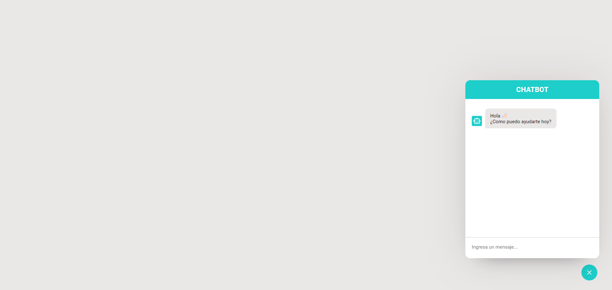
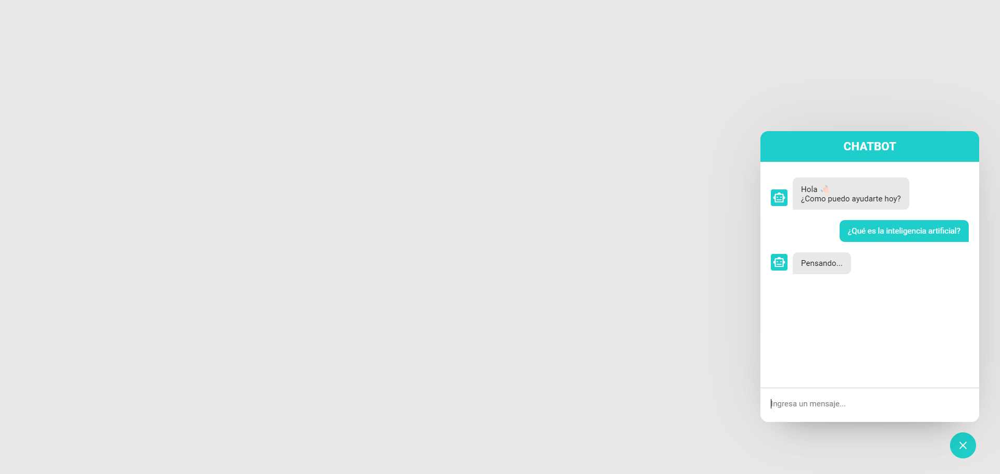
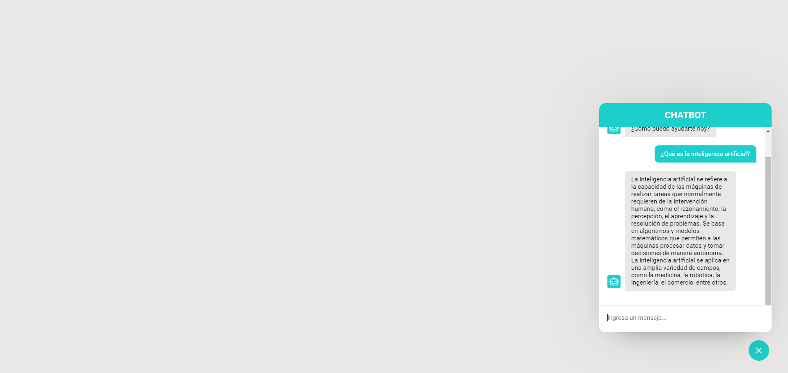
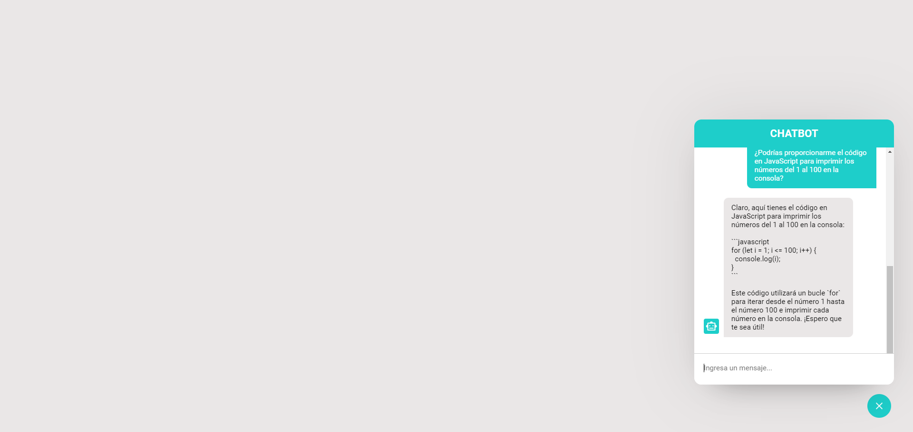

# Chatbot UI

## Descripción

Este proyecto implementa una interfaz de usuario para un chatbot, diseñado para proporcionar asistencia interactiva a los usuarios. El chatbot UI está desarrollado principalmente con HTML, CSS y JavaScript, facilitando la integración en cualquier sitio web.

## Capturas de Pantalla



---



---



---



## Características

- Botón interactivo para abrir y cerrar el chatbot.
- Diseño responsivo que funciona en dispositivos móviles y de escritorio.
- Integración con APIs para generar respuestas dinámicas.

## Tecnologías Utilizadas

- HTML
- CSS
- JavaScript

## Instalación

Para poner en marcha el proyecto localmente, sigue estos pasos:

1. Clona el repositorio:

   ```bash
   git clone https://github.com/marcosd59/chatbot-ui.git

   ```

2. Navega al directorio del proyecto:

   ```bash
   cd chatbot-ui
   ```

3. Abre el archivo `index.html` en tu navegador para ver el chatbot en acción.

## Configuración

Para interactuar con el chatbot y asegurarte de que pueda responder correctamente, debes configurar tu API key:

1. Abre el archivo `script.js`.
2. Encuentra la línea que contiene `const OPENAI_API_KEY = "";`.
3. Coloca tu API Key aquí: `const OPENAI_API_KEY = "your-api-key-here";`.

## Uso

Para interactuar con el chatbot:

1. Haz clic en el botón del chatbot en la esquina de la página.
2. Utiliza el campo de texto para enviar tus preguntas.
3. El chatbot responderá automáticamente.

## Contribuir

Si estás interesado en contribuir al proyecto, sigue estos pasos:

1. Forkea el repositorio.
2. Crea una nueva rama (`git checkout -b feature/nueva-feature`).
3. Realiza tus cambios y haz commit de los mismos (`git commit -am 'Añadir nueva feature'`).
4. Push a la rama (`git push origin feature/nueva-feature`).
5. Crea una nueva Pull Request.
